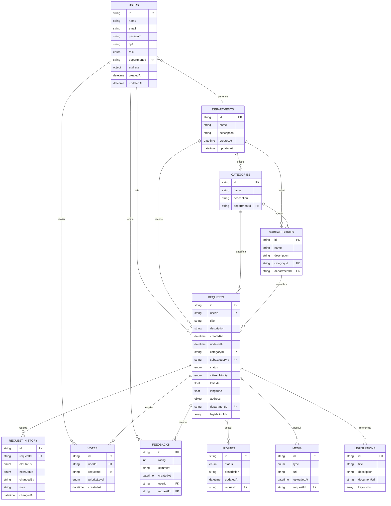

# Documentação Técnica do Sistema UrbanFlow

## 1. VISÃO GERAL DO PROJETO

### 1.1 Propósito do Sistema

O **UrbanFlow** é uma plataforma backend desenvolvida em Java/Spring Boot para a gestão de solicitações de serviços urbanos. O sistema permite que cidadãos reportem problemas de infraestrutura urbana (como buracos em vias, iluminação pública, coleta de lixo, etc.) e acompanhem o status dessas solicitações, enquanto órgãos públicos e operadores podem gerenciar, priorizar e resolver as demandas.

### 1.2 Principais Funcionalidades

| Módulo | Funcionalidades |
|--------|-----------------|
| **Usuários** | Cadastro, autenticação (JWT), perfis (Cidadão, Operador, Admin, Agência) |
| **Solicitações** | Criação, listagem, filtros por status/categoria/subcategoria, atualização de status com histórico |
| **Categorias e Subcategorias** | Hierarquia de serviços urbanos com vínculo a departamentos |
| **Votações** | Cidadãos podem votar na prioridade de solicitações (LOW/MEDIUM/HIGH/URGENT) |
| **Feedbacks** | Avaliação de serviços resolvidos com notas de 1 a 5 estrelas |
| **Dashboard** | Estatísticas gerais, top categorias, métricas de resolução |
| **Legislação** | Busca de documentos legais por palavras-chave |
| **Mídia** | Upload de imagens/vídeos associados a solicitações |
| **Auditoria** | Histórico de mudanças de status das solicitações |

### 1.3 Tecnologias e Dependências

| Tecnologia | Versão | Finalidade |
|------------|-------|------------|
| **Java** | 21 | Linguagem de programação |
| **Spring Boot** | 4.0.6 | Framework principal |
| **Spring Security** | Gerenciado pelo Spring Boot 4.0.6 | Autenticação e autorização |
| **Spring Data MongoDB** | Gerenciado pelo Spring Boot 4.0.6 | Persistência NoSQL |
| **Spring Validation** | Gerenciado pelo Spring Boot 4.0.6 | Validação de dados |
| **Spring WebMVC** | Gerenciado pelo Spring Boot 4.0.6 | API REST |
| **JJWT** | 0.12.6 | Geração e validação de tokens JWT |
| **SpringDoc OpenAPI** | 3.0.2 | Documentação interativa (Swagger UI) |
| **Lombok** | 1.18.46 | Redução de boilerplate |
| **Jacoco** | 0.8.12 | Cobertura de testes |
| **Maven** | 3.9.14 | Gerenciamento de dependências e build |


### 1.4 Perfis de acesso e responsabilidades

Embora o enum `Role` do código contenha os valores `CITIZEN`, `AGENCY`, `ADMIN` e `OPERATOR`, os fluxos funcionais e as regras de autorização atualmente documentadas concentram-se em três perfis efetivamente utilizados: **CITIZEN**, **OPERATOR** e **ADMIN**. O valor `AGENCY` permanece no enum, mas não participa dos principais fluxos de autorização apresentados nesta documentação.

| Perfil | Responsabilidades principais |
|--------|-------------------------------|
| **CITIZEN** | Cadastro e autenticação; criação e acompanhamento das próprias solicitações; inclusão de evidências de mídia; votação em solicitações de outros cidadãos; envio de feedback após resolução. |
| **OPERATOR** | Consulta das solicitações vinculadas ao seu departamento; tratamento operacional das demandas; atualização de status; consulta de histórico e indicadores permitidos ao departamento. |
| **ADMIN** | Administração global; gerenciamento de departamentos, categorias e subcategorias; consulta abrangente das solicitações; gestão de operadores; acesso aos indicadores administrativos. |

> **Observação:** o cadastro público de `/users` é orientado à criação de cidadãos. A atribuição de papéis privilegiados não deve ser controlada pelo cliente público.

### 1.5 Escopo arquitetural e contribuição da solução

O UrbanFlow não deve ser descrito como uma plataforma de interoperabilidade completa entre sistemas governamentais independentes. A contribuição implementada é uma **arquitetura backend modular, reutilizável e extensível para gestão de demandas urbanas**, capaz de sustentar diferentes módulos e departamentos de uma administração municipal por meio de contratos REST, regras de autorização, serviços desacoplados e persistência padronizada.

Nesse sentido, a prova de conceito demonstra a viabilidade de uma base arquitetural que favorece:

- organização centralizada das demandas;
- padronização da comunicação via HTTP/JSON;
- separação de responsabilidades por camadas;
- associação automática entre subcategorias, departamentos e solicitações;
- controle de acesso por perfis;
- rastreabilidade por histórico;
- participação cidadã por votos e feedbacks;
- evolução futura para integrações com outros sistemas municipais.

### 1.6 Visão dos ambientes da solução

| Ambiente | Objetivo | Banco de dados | Armazenamento de mídia | Execução |
|----------|----------|----------------|-------------------------|----------|
| **Desenvolvimento local** | Implementação e depuração | MongoDB local ou container | Cloudinary ou referência externa, conforme configuração | STS/Maven ou Docker |
| **Testes automatizados** | Validação unitária e web | Mocks e contexto de teste conforme a classe | Mockado | Maven/JUnit |
| **Docker local** | Reprodutibilidade do ambiente | Container `mongo` | Serviço externo configurável | Docker Compose |
| **Produção/deploy** | Demonstração e acesso remoto | MongoDB Atlas | Cloudinary | Render + Dockerfile |


---

## 2. MODELAGEM DO BANCO DE DADOS (DER)

### 2.1 Diagrama Entidade-Relacionamento (Mermaid)



### 2.2 Descrição das Coleções

#### `users`
| Campo | Tipo | Descrição | Restrições |
|-------|------|-----------|------------|
| id | String (PK) | Identificador único | Gerado automaticamente |
| name | String | Nome completo | Obrigatório |
| email | String | E-mail para login | Único, obrigatório |
| password | String | Hash da senha | Obrigatório |
| cpf | String | CPF do usuário | Único, obrigatório, validado |
| role | String (ENUM) | Perfil do usuário | CITIZEN, AGENCY, ADMIN, OPERATOR |
| departmentId | String (FK) | Departamento vinculado (operadores) | Opcional |
| address | Object | Endereço do usuário | Opcional |
| createdAt | DateTime | Data de criação | Automático |
| updatedAt | DateTime | Data da última atualização | Automático |

#### `departments`
| Campo | Tipo | Descrição | Restrições |
|-------|------|-----------|------------|
| id | String (PK) | Identificador único | Gerado automaticamente |
| name | String | Nome do departamento | Único, obrigatório |
| description | String | Descrição do departamento | Obrigatório |
| createdAt | DateTime | Data de criação | Automático |
| updatedAt | DateTime | Data da última atualização | Automático |

#### `categories`
| Campo | Tipo | Descrição | Restrições |
|-------|------|-----------|------------|
| id | String (PK) | Identificador único | Gerado automaticamente |
| name | String | Nome da categoria | Obrigatório |
| description | String | Descrição da categoria | Obrigatório |
| departmentId | String (FK) | Departamento responsável | Obrigatório |

#### `subcategories`
| Campo | Tipo | Descrição | Restrições |
|-------|------|-----------|------------|
| id | String (PK) | Identificador único | Gerado automaticamente |
| name | String | Nome da subcategoria | Obrigatório |
| description | String | Descrição da subcategoria | Obrigatório |
| categoryId | String (FK) | Categoria pai | Obrigatório |
| departmentId | String (FK) | Departamento responsável | Obrigatório |

#### `requests`
| Campo | Tipo | Descrição | Restrições |
|-------|------|-----------|------------|
| id | String (PK) | Identificador único | Gerado automaticamente |
| userId | String (FK) | Autor da solicitação | Obrigatório |
| title | String | Título da solicitação | Obrigatório |
| description | String | Descrição detalhada | Obrigatório |
| createdAt | DateTime | Data de criação | Automático |
| updatedAt | DateTime | Data da última atualização | Automático |
| categoryId | String (FK) | Categoria da solicitação | Obrigatório |
| subCategoryId | String (FK) | Subcategoria da solicitação | Obrigatório |
| status | String (ENUM) | Status atual | RECEIVED, UNDER_REVIEW, APPROVED, IN_PROGRESS, RESOLVED, REJECTED, CANCELLED |
| citizenPriority | String (ENUM) | Prioridade informada pelo cidadão | LOW, MEDIUM, HIGH, URGENT |
| latitude | Double | Coordenada geográfica | Obrigatório |
| longitude | Double | Coordenada geográfica | Obrigatório |
| address | Object | Endereço do problema | Obrigatório |
| departmentId | String (FK) | Departamento responsável | Definido automaticamente |
| legislationIds | Array de Strings | Referências a leis | Opcional |

#### `request_history`
| Campo | Tipo | Descrição | Restrições |
|-------|------|-----------|------------|
| id | String (PK) | Identificador único | Gerado automaticamente |
| requestId | String (FK) | Solicitação associada | Obrigatório |
| oldStatus | String (ENUM) | Status anterior | Obrigatório |
| newStatus | String (ENUM) | Novo status | Obrigatório |
| changedBy | String | E-mail do usuário que alterou | Obrigatório |
| note | String | Observação da alteração | Opcional |
| changedAt | DateTime | Data da alteração | Automático |

#### `votes`
| Campo | Tipo | Descrição | Restrições |
|-------|------|-----------|------------|
| id | String (PK) | Identificador único | Gerado automaticamente |
| userId | String (FK) | Votante | Obrigatório, único por request |
| requestId | String (FK) | Solicitação votada | Obrigatório |
| priorityLevel | String (ENUM) | Prioridade atribuída | LOW, MEDIUM, HIGH |
| createdAt | DateTime | Data do voto | Automático |

#### `feedbacks`
| Campo | Tipo | Descrição | Restrições |
|-------|------|-----------|------------|
| id | String (PK) | Identificador único | Gerado automaticamente |
| rating | Integer | Nota de 1 a 5 | Obrigatório |
| comment | String | Comentário opcional | Máximo 500 caracteres |
| createdAt | DateTime | Data do feedback | Automático |
| userId | String (FK) | Autor do feedback | Obrigatório |
| requestId | String (FK) | Solicitação avaliada | Obrigatório (único por usuário) |

#### `updates`
| Campo | Tipo | Descrição | Restrições |
|-------|------|-----------|------------|
| id | String (PK) | Identificador único | Gerado automaticamente |
| status | String (ENUM) | Status da solicitação | Obrigatório |
| description | String | Descrição da atualização | Obrigatório |
| updatedAt | DateTime | Data da atualização | Automático |
| requestId | String (FK) | Solicitação atualizada | Obrigatório |

#### `media`
| Campo | Tipo | Descrição | Restrições |
|-------|------|-----------|------------|
| id | String (PK) | Identificador único | Gerado automaticamente |
| type | String (ENUM) | Tipo de mídia | IMAGE, VIDEO |
| url | String | URL do arquivo | Obrigatório |
| uploadedAt | DateTime | Data do upload | Automático |
| requestId | String (FK) | Solicitação associada | Obrigatório |

#### `legislations`
| Campo | Tipo | Descrição | Restrições |
|-------|------|-----------|------------|
| id | String (PK) | Identificador único | Gerado automaticamente |
| title | String | Título da lei | Obrigatório |
| description | String | Descrição | Obrigatório |
| documentUrl | String | Link para o documento | Obrigatório |
| keywords | Array de Strings | Palavras-chave para busca | Opcional |

---

## 3. MODELAGEM UML (DIAGRAMA DE CLASSES)

### 3.1 Diagrama de Classes Principal

```mermaid
classDiagram
    %% Controllers
    class AuthController {
        -AuthService authService
        +login(LoginDTO) ResponseEntity
        +me() ResponseEntity
    }

    class RequestController {
        -RequestService requestService
        +create(CreateRequestDTO) ResponseEntity
        +findAll() ResponseEntity
        +findById(String) ResponseEntity
        +findByStatus(RequestStatus) ResponseEntity
        +findByCategory(String) ResponseEntity
        +findBySubCategory(String) ResponseEntity
        +findByUser(String) ResponseEntity
        +findByDepartment(String) ResponseEntity
        +getStatistics() ResponseEntity
        +getCategoryStatistics(String) ResponseEntity
        +getSubCategoryStatistics(String) ResponseEntity
        +search(...) ResponseEntity
        +update(String, UpdateRequestDTO) ResponseEntity
        +updateStatus(String, UpdateRequestStatusDTO) ResponseEntity
        +delete(String) ResponseEntity
    }

    class CategoryController {
        -CategoryService categoryService
        +create(CreateCategoryDTO) ResponseEntity
        +findAll() ResponseEntity
        +findById(String) ResponseEntity
        +update(String, UpdateCategoryDTO) ResponseEntity
        +delete(String) ResponseEntity
    }

    class SubCategoryController {
        -SubCategoryService subCategoryService
        +create(CreateSubCategoryDTO) ResponseEntity
        +findAll() ResponseEntity
        +findById(String) ResponseEntity
        +findByCategory(String) ResponseEntity
        +update(String, UpdateSubCategoryDTO) ResponseEntity
        +delete(String) ResponseEntity
    }

    class UserController {
        -UserService userService
        +findAll() ResponseEntity
        +findById(String) ResponseEntity
        +findOperatorsByDepartment(String) ResponseEntity
        +create(CreateUserDTO) ResponseEntity
        +update(String, UpdateUserDTO) ResponseEntity
        +delete(String) ResponseEntity
    }

    class VoteController {
        -VoteService voteService
        +create(CreateVoteDTO) ResponseEntity
        +findAll() ResponseEntity
        +findByRequest(String) ResponseEntity
        +getRequestPriority(String) ResponseEntity
    }

    class FeedbackController {
        -FeedbackService feedbackService
        +create(CreateFeedbackDTO) ResponseEntity
        +findAll() ResponseEntity
        +findByRequest(String) ResponseEntity
        +getStatistics(String) ResponseEntity
    }

    class DashboardController {
        -DashboardService dashboardService
        +getStatistics() ResponseEntity
        +getTopCategories() ResponseEntity
        +getTopSubCategories() ResponseEntity
        +overview() ResponseEntity
    }

    %% Services
    class RequestService {
        -RequestCommandService commandService
        -RequestQueryService queryService
        -RequestWorkflowService workflowService
        -RequestStatisticsService statisticsService
        +create(CreateRequestDTO) RequestResponseDTO
        +update(String, UpdateRequestDTO) RequestResponseDTO
        +delete(String) void
        +updateStatus(String, UpdateRequestStatusDTO) RequestResponseDTO
        +findAll() List~RequestResponseDTO~
        +findById(String) RequestResponseDTO
        +findByStatus(RequestStatus) List~RequestResponseDTO~
        +findByCategory(String) List~RequestResponseDTO~
        +findBySubCategory(String) List~RequestResponseDTO~
        +findByUser(String) List~RequestResponseDTO~
        +findByDepartment(String) List~RequestResponseDTO~
        +search(...) Page~RequestResponseDTO~
        +getStatistics() RequestStatisticsDTO
        +getCategoryStatistics(String) CategoryStatisticsDTO
        +getSubCategoryStatistics(String) SubCategoryStatisticsDTO
    }

    class UserService {
        -UserCommandService commandService
        -UserQueryService queryService
        +create(CreateUserDTO) UserResponseDTO
        +update(String, UpdateUserDTO) UserResponseDTO
        +delete(String) void
        +findById(String) UserResponseDTO
        +findAll() List~UserResponseDTO~
        +findOperatorsByDepartment(String) List~UserResponseDTO~
    }

    class CategoryService {
        -CategoryCommandService commandService
        -CategoryQueryService queryService
        +create(CreateCategoryDTO) CategoryResponseDTO
        +findAll() List~CategoryResponseDTO~
        +findById(String) CategoryResponseDTO
        +update(String, UpdateCategoryDTO) CategoryResponseDTO
        +delete(String) void
    }

    class SubCategoryService {
        -SubCategoryCommandService commandService
        -SubCategoryQueryService queryService
        +create(CreateSubCategoryDTO) SubCategoryResponseDTO
        +findAll() List~SubCategoryResponseDTO~
        +findById(String) SubCategoryResponseDTO
        +findByCategory(String) List~SubCategoryResponseDTO~
        +update(String, UpdateSubCategoryDTO) SubCategoryResponseDTO
        +delete(String) void
    }

    class TokenService {
        -String secret
        -Long expiration
        +generateToken(String, String) String
        +extractUsername(String) String
        +isTokenValid(String) boolean
        +getSigningKey() SecretKey
    }

    class SecurityService {
        +getAuthenticatedUser() UserDetailsImplementation
        +getAuthenticatedEmail() String
        +getAuthenticatedUserId() String
        +getAuthenticatedDepartmentId() String
        +getAuthenticatedRole() Role
        +isAdmin() boolean
        +isOperator() boolean
        +isCitizen() boolean
    }

    class AuthorizationService {
        -SecurityService securityService
        +validateRequestAccess(Request) void
    }

    class RequestWorkflowService {
        -RequestRepository requestRepository
        -RequestValidationService validationService
        -SecurityService securityService
        -RequestHistoryRepository historyRepository
        -RequestMapper requestMapper
        +updateStatus(String, UpdateRequestStatusDTO) RequestResponseDTO
    }

    %% Repositories
    class RequestRepository {
        +findByStatus(RequestStatus) List~Request~
        +findByCategoryId(String) List~Request~
        +findBySubCategoryId(String) List~Request~
        +findByUserId(String) List~Request~
        +findByDepartmentId(String) List~Request~
    }

    class UserRepository {
        +findByEmail(String) Optional~User~
        +findByCpf(String) Optional~User~
        +existsByEmail(String) boolean
        +existsByCpf(String) boolean
        +findByRole(Role) List~User~
        +findByRoleAndDepartmentId(Role, String) List~User~
    }

    class CategoryRepository {
    }

    class SubCategoryRepository {
        +findByCategoryId(String) List~SubCategory~
    }

    class VoteRepository {
        +existsByUserIdAndRequestId(String, String) boolean
        +findByRequestId(String) List~Vote~
    }

    class FeedbackRepository {
        +findByRequestId(String) List~Feedback~
        +existsByUserIdAndRequestId(String, String) boolean
    }

    class RequestHistoryRepository {
        +findByRequestIdOrderByChangedAtAsc(String) List~RequestHistory~
    }

    %% Models
    class Request {
        -String id
        -String userId
        -String title
        -String description
        -LocalDateTime createdAt
        -LocalDateTime updatedAt
        -String categoryId
        -String subCategoryId
        -RequestStatus status
        -PriorityLevel citizenPriority
        -Double latitude
        -Double longitude
        -Address address
        -String departmentId
        -List~String~ legislationIds
    }

    class User {
        -String id
        -String name
        -String email
        -String password
        -String cpf
        -Role role
        -String departmentId
        -Address address
        -LocalDateTime createdAt
        -LocalDateTime updatedAt
    }

    class Category {
        -String id
        -String name
        -String description
        -String departmentId
    }

    class SubCategory {
        -String id
        -String name
        -String description
        -String categoryId
        -String departmentId
    }

    class Vote {
        -String id
        -String userId
        -String requestId
        -PriorityLevel priorityLevel
        -LocalDateTime createdAt
    }

    class Feedback {
        -String id
        -Integer rating
        -String comment
        -LocalDateTime createdAt
        -String userId
        -String requestId
    }

    class RequestHistory {
        -String id
        -String requestId
        -RequestStatus oldStatus
        -RequestStatus newStatus
        -String changedBy
        -String note
        -LocalDateTime changedAt
    }

    class Department {
        -String id
        -String name
        -String description
        -LocalDateTime createdAt
        -LocalDateTime updatedAt
    }

    class Update {
        -String id
        -RequestStatus status
        -String description
        -LocalDateTime updatedAt
        -String requestId
    }

    class Media {
        -String id
        -MediaType type
        -String url
        -LocalDateTime uploadedAt
        -String requestId
    }

    class Legislation {
        -String id
        -String title
        -String description
        -String documentUrl
        -List~String~ keywords
    }

    class Address {
        -String cep
        -String street
        -String number
        -String neighborhood
        -String city
        -String state
        -String complement
    }

    %% DTOs
    class CreateRequestDTO {
        -String title
        -String description
        -String categoryId
        -String subCategoryId
        -PriorityLevel citizenPriority
        -Double latitude
        -Double longitude
        -AddressDTO address
    }

    class RequestResponseDTO {
        -String id
        -String title
        -String description
        -String userId
        -String categoryId
        -String subCategoryId
        -PriorityLevel citizenPriority
        -RequestStatus status
        -Double latitude
        -Double longitude
        -AddressResponseDTO address
        -String departmentId
        -LocalDateTime createdAt
    }

    class UserResponseDTO {
        -String id
        -String name
        -String email
        -Role role
        -String departmentId
        -AddressResponseDTO address
        -LocalDateTime createdAt
        -LocalDateTime updatedAt
    }

    class CategoryResponseDTO {
        -String id
        -String name
        -String description
        -String departmentId
    }

    class SubCategoryResponseDTO {
        -String id
        -String name
        -String description
        -String categoryId
        -String departmentId
    }

    class VoteResponseDTO {
        -String id
        -String userId
        -String requestId
        -PriorityLevel priorityLevel
        -LocalDateTime createdAt
    }

    class FeedbackResponseDTO {
        -String id
        -Integer rating
        -String comment
        -LocalDateTime createdAt
        -String userId
        -String requestId
    }

    class RequestHistoryResponseDTO {
        -String id
        -RequestStatus oldStatus
        -RequestStatus newStatus
        -String changedBy
        -String note
        -LocalDateTime changedAt
    }

    class LoginDTO {
        -String email
        -String password
    }

    class LoginResponseDTO {
        -String token
    }

    %% ENUMs
    class RequestStatus {
        <<enum>>
        RECEIVED
        UNDER_REVIEW
        APPROVED
        IN_PROGRESS
        RESOLVED
        REJECTED
        CANCELLED
    }

    class PriorityLevel {
        <<enum>>
        LOW
        MEDIUM
        HIGH
        URGENT
    }

    class Role {
        <<enum>>
        CITIZEN
        AGENCY
        ADMIN
        OPERATOR
    }

    class MediaType {
        <<enum>>
        IMAGE
        VIDEO
    }

    %% Mappers
    class RequestMapper {
        -AddressMapper addressMapper
        +toEntity(CreateRequestDTO) Request
        +updateEntity(Request, UpdateRequestDTO) void
        +toResponse(Request) RequestResponseDTO
        +toDetailsResponse(Request) RequestDetailsDTO
        +toStatisticsResponse(...) RequestStatisticsDTO
    }

    class UserMapper {
        -AddressMapper addressMapper
        +toEntity(CreateUserDTO, String) User
        +updateEntity(User, UpdateUserDTO) void
        +toResponse(User) UserResponseDTO
    }

    %% Security
    class SecurityConfig {
        -JwtAuthenticationFilter jwtAuthenticationFilter
        +passwordEncoder() PasswordEncoder
        +authenticationManager() AuthenticationManager
        +securityFilterChain(HttpSecurity) SecurityFilterChain
    }

    class JwtAuthenticationFilter {
        -TokenService tokenService
        -UserDetailsService userDetailsService
        +doFilterInternal(...) void
    }

    class CustomUserDetailsService {
        -UserRepository userRepository
        +loadUserByUsername(String) UserDetails
    }

    class UserDetailsImplementation {
        -String id
        -String email
        -String password
        -String departmentId
        -Role role
        -Collection authorities
        +getAuthorities() Collection
        +getUsername() String
        +isAccountNonExpired() boolean
        +isAccountNonLocked() boolean
        +isCredentialsNonExpired() boolean
        +isEnabled() boolean
    }

    %% Relationships
    AuthController --> AuthService
    RequestController --> RequestService
    CategoryController --> CategoryService
    SubCategoryController --> SubCategoryService
    UserController --> UserService
    VoteController --> VoteService
    FeedbackController --> FeedbackService
    DashboardController --> DashboardService

    RequestService --> RequestCommandService
    RequestService --> RequestQueryService
    RequestService --> RequestWorkflowService
    RequestService --> RequestStatisticsService

    RequestCommandService --> RequestRepository
    RequestCommandService --> RequestValidationService
    RequestCommandService --> SecurityService
    RequestCommandService --> RequestMapper
    RequestCommandService --> DateTimeProvider

    RequestQueryService --> RequestRepository
    RequestQueryService --> MongoTemplate
    RequestQueryService --> SecurityService
    RequestQueryService --> RequestMapper

    RequestWorkflowService --> RequestRepository
    RequestWorkflowService --> RequestValidationService
    RequestWorkflowService --> SecurityService
    RequestWorkflowService --> RequestHistoryRepository
    RequestWorkflowService --> RequestMapper

    RequestValidationService --> AuthorizationService
    RequestValidationService --> UserRepository
    RequestValidationService --> SubCategoryRepository

    SecurityConfig --> JwtAuthenticationFilter
    SecurityConfig --> PasswordEncoder

    JwtAuthenticationFilter --> TokenService
    JwtAuthenticationFilter --> CustomUserDetailsService

    TokenService --> Jwts

    CustomUserDetailsService --> UserRepository
    CustomUserDetailsService --> UserDetailsImplementation

    AuthorizationService --> SecurityService

    RequestRepository --> Request
    UserRepository --> User
    CategoryRepository --> Category
    SubCategoryRepository --> SubCategory
    VoteRepository --> Vote
    FeedbackRepository --> Feedback
    RequestHistoryRepository --> RequestHistory

    RequestMapper --> AddressMapper
    UserMapper --> AddressMapper
```



---

## 4. ARQUITETURA E FLUXO DE REQUISIÇÃO

### 4.1 Estrutura de Pastas

```
src/main/java/com/iagomoreira/urbanflow/
├── config/
│   └── SecurityConfig.java                 # Configuração de segurança
├── controller/
│   ├── AuthController.java                 # Autenticação
│   ├── CategoryController.java             # Gerenciamento de categorias
│   ├── DashboardController.java            # Métricas e estatísticas
│   ├── DepartmentController.java           # Gerenciamento de departamentos
│   ├── FeedbackController.java             # Avaliações de solicitações
│   ├── LegislationController.java          # Busca de leis
│   ├── MediaController.java                # Upload de mídia
│   ├── RequestController.java              # Gerenciamento de solicitações
│   ├── RequestHistoryController.java       # Histórico de alterações
│   ├── SubCategoryController.java          # Gerenciamento de subcategorias
│   ├── UpdateController.java               # Atualizações de status
│   ├── UserController.java                 # Gerenciamento de usuários
│   └── VoteController.java                 # Votações em solicitações
├── dto/                                    # Data Transfer Objects
│   ├── address/
│   ├── auth/
│   ├── category/
│   ├── dashboard/
│   ├── department/
│   ├── feedback/
│   ├── legislation/
│   ├── media/
│   ├── request/
│   ├── requesthistory/
│   ├── subcategory/
│   ├── update/
│   ├── user/
│   └── vote/
├── exception/                              # Tratamento de exceções
│   ├── BusinessException.java
│   ├── DatabaseException.java
│   ├── FieldMessage.java
│   ├── GlobalExceptionHandler.java
│   ├── ResourceNotFoundException.java
│   ├── StandardError.java
│   └── ValidationError.java
├── mapper/                                 # Conversores entidade ↔ DTO
│   ├── AddressMapper.java
│   ├── CategoryMapper.java
│   ├── DashboardMapper.java
│   ├── DepartmentMapper.java
│   ├── FeedbackMapper.java
│   ├── LegislationMapper.java
│   ├── MediaMapper.java
│   ├── RequestHistoryMapper.java
│   ├── RequestMapper.java
│   ├── SubCategoryMapper.java
│   ├── UpdateMapper.java
│   ├── UserMapper.java
│   └── VoteMapper.java
├── model/                                  # Entidades do banco de dados
│   ├── enums/                              # Enumeradores
│   │   ├── MediaType.java
│   │   ├── PriorityLevel.java
│   │   ├── RequestStatus.java
│   │   └── Role.java
│   ├── Address.java
│   ├── Category.java
│   ├── Department.java
│   ├── Feedback.java
│   ├── Legislation.java
│   ├── Media.java
│   ├── Request.java
│   ├── RequestHistory.java
│   ├── SubCategory.java
│   ├── Update.java
│   ├── User.java
│   └── Vote.java
├── repository/                             # Interfaces de persistência
│   ├── CategoryRepository.java
│   ├── DepartmentRepository.java
│   ├── FeedbackRepository.java
│   ├── LegislationRepository.java
│   ├── MediaRepository.java
│   ├── RequestHistoryRepository.java
│   ├── RequestRepository.java
│   ├── SubCategoryRepository.java
│   ├── UpdateRepository.java
│   ├── UserRepository.java
│   └── VoteRepository.java
├── security/                               # Componentes de segurança
│   ├── CustomUserDetailsService.java
│   ├── JwtAuthenticationFilter.java
│   └── UserDetailsImplementation.java
├── service/                                # Camada de negócio
│   ├── auth/
│   │   ├── AuthService.java
│   │   ├── AuthenticationService.java
│   │   ├── CurrentUserService.java
│   │   └── TokenService.java
│   ├── category/
│   │   ├── CategoryCommandService.java
│   │   ├── CategoryQueryService.java
│   │   ├── CategoryService.java
│   │   └── CategoryValidationService.java
│   ├── common/
│   │   └── DateTimeProvider.java
│   ├── dashboard/
│   │   ├── DashboardMetricsService.java
│   │   ├── DashboardQueryService.java
│   │   ├── DashboardService.java
│   │   └── DashboardStatisticsService.java
│   ├── department/
│   │   ├── DepartmentCommandService.java
│   │   ├── DepartmentQueryService.java
│   │   ├── DepartmentService.java
│   │   └── DepartmentValidationService.java
│   ├── feedback/
│   │   ├── FeedbackCommandService.java
│   │   ├── FeedbackQueryService.java
│   │   ├── FeedbackService.java
│   │   ├── FeedbackStatisticsService.java
│   │   └── FeedbackValidationService.java
│   ├── legislation/
│   │   ├── LegislationQueryService.java
│   │   ├── LegislationService.java
│   │   └── LegislationValidationService.java
│   ├── media/
│   │   ├── MediaCommandService.java
│   │   ├── MediaQueryService.java
│   │   ├── MediaService.java
│   │   ├── MediaStorageService.java
│   │   └── MediaValidationService.java
│   ├── request/
│   │   ├── RequestCommandService.java
│   │   ├── RequestQueryService.java
│   │   ├── RequestService.java
│   │   ├── RequestStatisticsService.java
│   │   ├── RequestValidationService.java
│   │   └── RequestWorkflowService.java
│   ├── requesthistory/
│   │   ├── RequestHistoryQueryService.java
│   │   ├── RequestHistoryService.java
│   │   └── RequestHistoryValidationService.java
│   ├── security/
│   │   ├── AuthorizationService.java
│   │   └── SecurityService.java
│   ├── subcategory/
│   │   ├── SubCategoryCommandService.java
│   │   ├── SubCategoryQueryService.java
│   │   ├── SubCategoryService.java
│   │   └── SubCategoryValidationService.java
│   ├── update/
│   │   ├── UpdateCommandService.java
│   │   ├── UpdateQueryService.java
│   │   ├── UpdateService.java
│   │   └── UpdateValidationService.java
│   ├── user/
│   │   ├── UserCommandService.java
│   │   ├── UserQueryService.java
│   │   ├── UserService.java
│   │   └── UserValidationService.java
│   └── vote/
│       ├── VoteCommandService.java
│       ├── VoteQueryService.java
│       ├── VoteService.java
│       └── VoteValidationService.java
└── validation/                             # Validações customizadas
    ├── CpfValidator.java
    └── ValidCpf.java
```

### 4.2 Fluxo de Requisição Típico

```
┌─────────────────────────────────────────────────────────────────────────────┐
│                            FLUXO DE REQUISIÇÃO                              │
└─────────────────────────────────────────────────────────────────────────────┘

  Cliente (Frontend/Postman)
         │
         ▼
    ┌─────────┐
    │  HTTP    │   Request com JWT no Header "Authorization: Bearer <token>"
    │  Request │
    └─────────┘
         │
         ▼
┌─────────────────────────────────────────────────────────────────────────────┐
│                           SPRING BOOT FILTER CHAIN                          │
├─────────────────────────────────────────────────────────────────────────────┤
│                                                                             │
│  ┌─────────────────────────────────────────────────────────────────────┐   │
│  │                    JwtAuthenticationFilter                           │   │
│  │  - Extrai token do cabeçalho Authorization                          │   │
│  │  - Valida assinatura e expiração via TokenService                   │   │
│  │  - Extrai email do token                                            │   │
│  │  - Carrega UserDetails via CustomUserDetailsService                 │   │
│  │  - Define autenticação no SecurityContext                           │   │
│  └─────────────────────────────────────────────────────────────────────┘   │
│         │                                                                   │
│         ▼                                                                   │
│  ┌─────────────────────────────────────────────────────────────────────┐   │
│  │                       SecurityConfig                                 │   │
│  │  - Verifica autorização (@PreAuthorize)                             │   │
│  │  - Valida permissões por role (ADMIN, OPERATOR, CITIZEN)           │   │
│  └─────────────────────────────────────────────────────────────────────┘   │
│         │                                                                   │
│         ▼                                                                   │
│  ┌─────────────────────────────────────────────────────────────────────┐   │
│  │                      Controller Layer                               │   │
│  │  - Recebe DTO de entrada (@RequestBody, @PathVariable, @RequestParam)│   │
│  │  - Aplica validações (@Valid)                                      │   │
│  │  - Delega para o Service correspondente                            │   │
│  └─────────────────────────────────────────────────────────────────────┘   │
│         │                                                                   │
│         ▼                                                                   │
│  ┌─────────────────────────────────────────────────────────────────────┐   │
│  │                       Service Layer                                 │   │
│  │  - Orquestra CommandService e QueryService                         │   │
│  │  - Aplica regras de negócio                                        │   │
│  │  - Realiza validações (ValidationService)                          │   │
│  │  - Converte entidades ↔ DTOs via Mappers                          │   │
│  └─────────────────────────────────────────────────────────────────────┘   │
│         │                                                                   │
│         ▼                                                                   │
│  ┌─────────────────────────────────────────────────────────────────────┐   │
│  │                    Repository Layer                                 │   │
│  │  - Acessa MongoDB via Spring Data MongoDB                           │   │
│  │  - Queries personalizadas (MongoTemplate)                          │   │
│  │  - Paginação e ordenação                                           │   │
│  └─────────────────────────────────────────────────────────────────────┘   │
│         │                                                                   │
│         ▼                                                                   │
│  ┌─────────────────────────────────────────────────────────────────────┐   │
│  │                    MongoDB Database                                │   │
│  │  - Coleções: users, requests, categories, votes, feedbacks, etc.   │   │
│  └─────────────────────────────────────────────────────────────────────┘   │
└─────────────────────────────────────────────────────────────────────────────┘
         │
         ▼
    ┌─────────┐
    │  HTTP   │   Response com JSON
    │ Response│
    └─────────┘
```


### 4.3 Ciclo de vida de uma solicitação

A solicitação é criada com o status inicial `RECEIVED`. As transições válidas implementadas no serviço de validação são:

```text
RECEIVED
   ├──> UNDER_REVIEW
   │       ├──> APPROVED
   │       │       └──> IN_PROGRESS
   │       │               └──> RESOLVED
   │       └──> REJECTED
   └──> CANCELLED
```

As regras impedem transições arbitrárias e também bloqueiam alterações incompatíveis com solicitações finalizadas. Esse fluxo é importante para manter consistência operacional e rastreabilidade.

### 4.4 Regras de acesso às solicitações

Além das anotações `@PreAuthorize`, o domínio utiliza validações de acesso em serviço:

- **ADMIN:** pode consultar solicitações de qualquer departamento;
- **OPERATOR:** é limitado ao departamento associado ao usuário autenticado;
- **CITIZEN:** é limitado às próprias solicitações em operações que exigem propriedade;
- a busca paginada ajusta automaticamente os filtros de `departmentId` ou `userId` conforme o papel autenticado;
- alterações de status são restritas a `ADMIN` e `OPERATOR`;
- votos são restritos a cidadãos e existem regras contra voto duplicado e voto na própria solicitação;
- feedback é aceito apenas para solicitações resolvidas e não pode ser duplicado pelo mesmo usuário.

### 4.5 Estratégia Command/Query

Os serviços foram subdivididos por responsabilidade:

```text
Controller
    ↓
Service (fachada/orquestração)
    ├── CommandService      → operações de escrita
    ├── QueryService        → operações de leitura
    ├── ValidationService   → regras e pré-condições
    ├── StatisticsService   → agregações/indicadores, quando aplicável
    └── WorkflowService     → transições e histórico, quando aplicável
             ↓
Repository / MongoTemplate
             ↓
MongoDB
```

Essa separação não constitui CQRS completo com modelos de leitura e escrita independentes, mas aplica **segregação de responsabilidades entre comandos e consultas** dentro da camada de serviço.


### 4.6 Mapeamento de Endpoints

#### **Autenticação** (`/auth`)

| Método | Endpoint | Parâmetros | Descrição | Permissão |
|--------|----------|------------|-----------|-----------|
| POST | `/auth/login` | `LoginDTO` (email, password) | Autentica usuário e retorna token JWT | Público |
| GET | `/auth/me` | - | Retorna dados do usuário autenticado | Autenticado |

#### **Usuários** (`/users`)

| Método | Endpoint | Parâmetros | Descrição | Permissão |
|--------|----------|------------|-----------|-----------|
| GET | `/users` | - | Lista todos os usuários | Autenticado |
| GET | `/users/{id}` | path: id | Busca usuário por ID | Autenticado |
| GET | `/users/operators/department/{departmentId}` | path: departmentId | Lista operadores por departamento | ADMIN |
| POST | `/users` | `CreateUserDTO` | Cria novo usuário (registro público) | Público |
| PUT | `/users/{id}` | path: id, `UpdateUserDTO` | Atualiza dados do usuário | Autenticado |
| DELETE | `/users/{id}` | path: id | Remove usuário | Autenticado |

#### **Departamentos** (`/departments`)

| Método | Endpoint | Parâmetros | Descrição | Permissão |
|--------|----------|------------|-----------|-----------|
| POST | `/departments` | `CreateDepartmentDTO` | Cria novo departamento | ADMIN |
| GET | `/departments` | - | Lista todos os departamentos | Autenticado |
| GET | `/departments/{id}` | path: id | Busca departamento por ID | Autenticado |
| PUT | `/departments/{id}` | path: id, `UpdateDepartmentDTO` | Atualiza departamento | ADMIN |
| DELETE | `/departments/{id}` | path: id | Remove departamento | ADMIN |

#### **Categorias** (`/categories`)

| Método | Endpoint | Parâmetros | Descrição | Permissão |
|--------|----------|------------|-----------|-----------|
| POST | `/categories` | `CreateCategoryDTO` | Cria nova categoria | ADMIN |
| GET | `/categories` | - | Lista todas as categorias | Autenticado |
| GET | `/categories/{id}` | path: id | Busca categoria por ID | Autenticado |
| PUT | `/categories/{id}` | path: id, `UpdateCategoryDTO` | Atualiza categoria | ADMIN |
| DELETE | `/categories/{id}` | path: id | Remove categoria | ADMIN |

#### **Subcategorias** (`/subcategories`)

| Método | Endpoint | Parâmetros | Descrição | Permissão |
|--------|----------|------------|-----------|-----------|
| POST | `/subcategories` | `CreateSubCategoryDTO` | Cria nova subcategoria | ADMIN |
| GET | `/subcategories` | - | Lista todas as subcategorias | Autenticado |
| GET | `/subcategories/{id}` | path: id | Busca subcategoria por ID | Autenticado |
| GET | `/subcategories/category/{categoryId}` | path: categoryId | Lista subcategorias por categoria | Autenticado |
| PUT | `/subcategories/{id}` | path: id, `UpdateSubCategoryDTO` | Atualiza subcategoria | ADMIN |
| DELETE | `/subcategories/{id}` | path: id | Remove subcategoria | ADMIN |

#### **Solicitações** (`/requests`)

| Método | Endpoint | Parâmetros | Descrição | Permissão |
|--------|----------|------------|-----------|-----------|
| POST | `/requests` | `CreateRequestDTO` | Cria nova solicitação | CITIZEN |
| GET | `/requests` | - | Lista todas as solicitações (filtradas por role) | Autenticado |
| GET | `/requests/{id}` | path: id | Busca solicitação por ID | Autenticado |
| GET | `/requests/status/{status}` | path: status | Lista por status | Autenticado |
| GET | `/requests/category/{categoryId}` | path: categoryId | Lista por categoria | Autenticado |
| GET | `/requests/subcategory/{subCategoryId}` | path: subCategoryId | Lista por subcategoria | Autenticado |
| GET | `/requests/user/{userId}` | path: userId | Lista por usuário | Autenticado |
| GET | `/requests/department/{departmentId}` | path: departmentId | Lista por departamento | ADMIN/OPERATOR |
| GET | `/requests/statistics` | - | Estatísticas globais | Autenticado |
| GET | `/requests/statistics/category/{categoryId}` | path: categoryId | Estatísticas por categoria | Autenticado |
| GET | `/requests/statistics/subcategory/{subCategoryId}` | path: subCategoryId | Estatísticas por subcategoria | Autenticado |
| GET | `/requests/search` | query: status, categoryId, subCategoryId, departmentId, userId, page, size, sortBy, direction | Busca paginada com filtros | Autenticado |
| PUT | `/requests/{id}` | path: id, `UpdateRequestDTO` | Atualiza solicitação | Autenticado (autor) |
| PATCH | `/requests/{id}/status` | path: id, `UpdateRequestStatusDTO` | Atualiza status | ADMIN/OPERATOR |
| DELETE | `/requests/{id}` | path: id | Remove solicitação | Autenticado (autor) |

#### **Histórico** (`/request-history`)

| Método | Endpoint | Parâmetros | Descrição | Permissão |
|--------|----------|------------|-----------|-----------|
| GET | `/request-history/request/{requestId}` | path: requestId | Histórico de alterações da solicitação | ADMIN/OPERATOR |

#### **Votações** (`/votes`)

| Método | Endpoint | Parâmetros | Descrição | Permissão |
|--------|----------|------------|-----------|-----------|
| POST | `/votes` | `CreateVoteDTO` | Vota em uma solicitação | CITIZEN |
| GET | `/votes` | - | Lista todos os votos | Autenticado |
| GET | `/votes/request/{requestId}` | path: requestId | Votos por solicitação | Autenticado |
| GET | `/votes/request/{requestId}/priority` | path: requestId | Distribuição de prioridades | Autenticado |

#### **Feedbacks** (`/feedbacks`)

| Método | Endpoint | Parâmetros | Descrição | Permissão |
|--------|----------|------------|-----------|-----------|
| POST | `/feedbacks` | `CreateFeedbackDTO` | Envia feedback para solicitação resolvida | CITIZEN |
| GET | `/feedbacks` | - | Lista todos os feedbacks | Autenticado |
| GET | `/feedbacks/request/{requestId}` | path: requestId | Feedbacks por solicitação | Autenticado |
| GET | `/feedbacks/request/{requestId}/statistics` | path: requestId | Estatísticas de avaliação | Autenticado |

#### **Atualizações** (`/updates`)

| Método | Endpoint | Parâmetros | Descrição | Permissão |
|--------|----------|------------|-----------|-----------|
| POST | `/updates` | `CreateUpdateDTO` | Adiciona atualização a uma solicitação | ADMIN/OPERATOR |
| GET | `/updates` | - | Lista todas as atualizações | Autenticado |
| GET | `/updates/request/{requestId}` | path: requestId | Atualizações por solicitação | Autenticado |

#### **Mídia** (`/media`)

| Método | Endpoint | Parâmetros | Descrição | Permissão |
|--------|----------|------------|-----------|-----------|
| POST | `/media` | `CreateMediaDTO` | Adiciona mídia a uma solicitação | Autenticado |
| GET | `/media` | - | Lista todas as mídias | Autenticado |
| GET | `/media/{id}` | path: id | Busca mídia por ID | Autenticado |
| GET | `/media/request/{requestId}` | path: requestId | Mídias por solicitação | Autenticado |

#### **Legislação** (`/legislations`)

| Método | Endpoint | Parâmetros | Descrição | Permissão |
|--------|----------|------------|-----------|-----------|
| GET | `/legislations` | - | Lista todas as leis | Autenticado |
| GET | `/legislations/{id}` | path: id | Busca lei por ID | Autenticado |
| GET | `/legislations/search` | query: keyword | Busca por palavra-chave | Autenticado |

#### **Dashboard** (`/dashboard`)

| Método | Endpoint | Parâmetros | Descrição | Permissão |
|--------|----------|------------|-----------|-----------|
| GET | `/dashboard/statistics` | - | Estatísticas gerais do sistema | Autenticado |
| GET | `/dashboard/top-categories` | - | Categorias mais utilizadas | Autenticado |
| GET | `/dashboard/top-subcategories` | - | Subcategorias mais utilizadas | Autenticado |
| GET | `/dashboard/overview` | - | Visão completa do dashboard | ADMIN/OPERATOR |

---

---

## 5. INSTALAÇÃO, CONFIGURAÇÃO E EXECUÇÃO

### 5.1 Pré-requisitos

| Ferramenta | Versão/uso |
|------------|------------|
| **Java** | 21 |
| **Maven** | Maven Wrapper incluído no projeto (`mvnw` / `mvnw.cmd`) |
| **Docker Desktop** | Recomendado para ambiente reproduzível |
| **MongoDB** | MongoDB 7 no Docker local ou MongoDB Atlas em produção |
| **Git** | Controle de versão e integração com o Render |
| **Postman/Insomnia** | Testes manuais da API |

### 5.2 Variáveis de ambiente

Credenciais e segredos não devem ser versionados no Git. A aplicação deve receber configurações sensíveis por variáveis de ambiente.

| Variável | Finalidade |
|----------|------------|
| `PORT` | Porta HTTP fornecida pelo ambiente de execução |
| `SPRING_DATA_MONGODB_URI` | Connection string fornecida à propriedade `spring.mongodb.uri` |
| `JWT_SECRET` | Chave de assinatura dos tokens |
| `JWT_EXPIRATION` | Tempo de expiração do JWT em milissegundos |
| `CLOUDINARY_CLOUD_NAME` | Identificador da conta Cloudinary |
| `CLOUDINARY_API_KEY` | Chave pública da API Cloudinary |
| `CLOUDINARY_API_SECRET` | Segredo da API Cloudinary |

> **Segurança:** valores reais de senha, chave JWT, connection string e `API_SECRET` não devem aparecer neste documento, no `application.properties`, no GitHub ou em capturas de tela públicas.

### 5.3 `application.properties` recomendado para Spring Boot 4

No Spring Boot 4, as propriedades principais de conexão do MongoDB usam o prefixo `spring.mongodb`. Assim, a configuração recomendada é:

```properties
spring.application.name=urbanflow

server.port=${PORT:8080}

spring.mongodb.uri=${SPRING_DATA_MONGODB_URI:mongodb://localhost:27017/urbanflow}

jwt.secret=${JWT_SECRET}
jwt.expiration=${JWT_EXPIRATION:86400000}

cloudinary.cloud-name=${CLOUDINARY_CLOUD_NAME}
cloudinary.api-key=${CLOUDINARY_API_KEY}
cloudinary.api-secret=${CLOUDINARY_API_SECRET}
```

Para execução via Docker Compose, o valor de fallback pode ser substituído pela variável `SPRING_DATA_MONGODB_URI=mongodb://mongo:27017/urbanflow`.

### 5.4 Build local

No Windows/PowerShell:

```powershell
.\mvnw.cmd clean verify
```

No Linux/macOS/Git Bash:

```bash
./mvnw clean verify
```

O comando `verify` é preferível porque executa os testes e aciona a fase em que o relatório JaCoCo está configurado.

Para empacotar sem executar testes:

```bash
./mvnw clean package -DskipTests
```

### 5.5 Execução local sem Docker

Configure as variáveis de ambiente e execute:

```bash
./mvnw spring-boot:run
```

ou:

```bash
java -jar target/urbanflow-0.0.1-SNAPSHOT.jar
```

### 5.6 Acesso local

| Recurso | URL |
|---------|-----|
| API | `http://localhost:8080` |
| Swagger UI | `http://localhost:8080/swagger-ui/index.html` |
| OpenAPI | `http://localhost:8080/v3/api-docs` |

---

## 6. CONTAINERIZAÇÃO COM DOCKER

### 6.1 Objetivo

A containerização torna a execução reproduzível e reduz dependências específicas da máquina do desenvolvedor. No ambiente local, a aplicação e o MongoDB podem ser executados como containers separados.

### 6.2 Dockerfile multi-stage

Estrutura recomendada:

```dockerfile
FROM eclipse-temurin:21-jdk AS build

WORKDIR /app
COPY . .

RUN chmod +x mvnw
RUN ./mvnw clean package -DskipTests

FROM eclipse-temurin:21-jre

WORKDIR /app

COPY --from=build /app/target/urbanflow-0.0.1-SNAPSHOT.jar app.jar

EXPOSE 8080

ENTRYPOINT ["java", "-jar", "app.jar"]
```

A primeira etapa compila a aplicação; a segunda contém somente o JRE e o artefato final.

### 6.3 Docker Compose local

Exemplo de composição para desenvolvimento:

```yaml
services:
  mongo:
    image: mongo:7
    container_name: urbanflow-mongo
    restart: always
    ports:
      - "27017:27017"
    volumes:
      - mongo_data:/data/db

  urbanflow:
    build: .
    container_name: urbanflow-api
    restart: always
    ports:
      - "8080:8080"
    depends_on:
      - mongo
    environment:
      SPRING_DATA_MONGODB_URI: mongodb://mongo:27017/urbanflow
      JWT_SECRET: ${JWT_SECRET}
      JWT_EXPIRATION: ${JWT_EXPIRATION:-86400000}
      CLOUDINARY_CLOUD_NAME: ${CLOUDINARY_CLOUD_NAME}
      CLOUDINARY_API_KEY: ${CLOUDINARY_API_KEY}
      CLOUDINARY_API_SECRET: ${CLOUDINARY_API_SECRET}

volumes:
  mongo_data:
```

### 6.4 Comandos Docker

```bash
# Construir e iniciar
docker compose up --build

# Executar em segundo plano
docker compose up -d --build

# Ver containers
docker compose ps

# Ver logs da API
docker compose logs -f urbanflow

# Parar containers
docker compose down

# Parar e remover volume local
docker compose down -v
```

### 6.5 Importante: Docker Compose x Render

O `docker-compose.yml` é utilizado para o **ambiente local**. Em um Web Service Docker no Render, o serviço de produção é construído a partir do **Dockerfile**, enquanto as variáveis são definidas no painel **Environment** do Render.

Portanto:

```text
LOCAL
Docker Compose
 ├── urbanflow-api
 └── urbanflow-mongo

PRODUÇÃO
Render (UrbanFlow API)
      │
      ├── MongoDB Atlas
      └── Cloudinary
```

---

## 7. IMPLANTAÇÃO EM NUVEM

### 7.1 Arquitetura de implantação

A arquitetura de implantação adotada/separada por serviço é:

```text
Cliente / Postman / Swagger
            │ HTTPS
            ▼
      Render Web Service
      UrbanFlow / Spring Boot
            │
      ┌─────┴───────────┐
      │                 │
      ▼                 ▼
MongoDB Atlas       Cloudinary
Dados estruturados  Imagens/Vídeos
```

### 7.2 Backend — Render

O backend é publicado como **Web Service**, construído a partir do Dockerfile versionado no GitHub.

Configurações relevantes:

- runtime baseado em Docker;
- porta recebida pela variável `PORT`;
- deploy acionado por commit na branch configurada;
- segredos cadastrados em **Environment Variables**;
- Swagger disponível no mesmo host, se mantido habilitado.

### 7.3 Banco — MongoDB Atlas

No ambiente de produção, não é necessário executar o container local `mongo`. A aplicação utiliza uma connection string `mongodb+srv://...` fornecida pelo Atlas por meio de `SPRING_DATA_MONGODB_URI`.

Cuidados necessários:

- usuário de banco próprio para a aplicação;
- senha forte e não versionada;
- definição explícita do banco `urbanflow` na URI;
- controle de acesso de rede compatível com o ambiente do Render;
- rotação de credenciais em caso de exposição.

### 7.4 Mídia — Cloudinary

O armazenamento de imagens e vídeos deve ser externo ao filesystem do container, pois containers de hospedagem não devem ser tratados como armazenamento persistente.

Fluxo recomendado:

```text
Arquivo enviado
      ↓
UrbanFlow
      ↓
Cloudinary
      ↓
secure_url
      ↓
Documento Media no MongoDB
```

O MongoDB armazena metadados como:

- tipo (`IMAGE`/`VIDEO`);
- URL;
- data de upload;
- `requestId`.

> **Nota de implementação:** a documentação original já previa `MediaStorageService`. Caso o upload binário ainda esteja em validação, o Cloudinary deve ser tratado como integração de implantação em andamento até que o `MediaStorageService` esteja efetivamente conectado ao fluxo de `MediaCommandService`.

### 7.5 Separação entre ambientes

| Item | Local | Produção |
|------|-------|----------|
| API | `localhost:8080` | URL HTTPS do Render |
| MongoDB | `mongo:27017` no Compose ou localhost | MongoDB Atlas |
| Arquivos | Cloudinary/configuração de teste | Cloudinary |
| Secrets | `.env` ignorado pelo Git | Environment Variables do Render |
| Build | Maven/STS/Docker | Dockerfile no Render |

---

## 8. TESTES AUTOMATIZADOS E COBERTURA

### 8.1 Estratégia de testes

A suíte de testes foi organizada para cobrir principalmente as camadas que concentram comportamento:

- `ValidationService`: regras e exceções;
- `CommandService`: escrita e efeitos colaterais;
- `QueryService`: consultas, filtros e autorização contextual;
- Controllers: contrato HTTP com `MockMvc`;
- serviços de autenticação, dashboard e segurança;
- mappers, conforme a suíte executada.

As principais tecnologias utilizadas são:

| Tecnologia | Uso |
|------------|-----|
| **JUnit 5** | Estrutura dos testes |
| **Mockito** | Mocks, stubs e verificações |
| **MockMvc** | Testes da camada HTTP |
| **AssertJ** | Asserções expressivas |
| **JaCoCo 0.8.12** | Métricas de cobertura |

### 8.2 Execução

```bash
./mvnw clean verify
```

No Windows:

```powershell
.\mvnw.cmd clean verify
```

Com a configuração do plugin vinculada à fase `verify`, o relatório é gerado em:

```text
target/site/jacoco/index.html
```

### 8.3 Resultado de cobertura registrado

O relatório JaCoCo analisado apresentou:

| Métrica | Resultado |
|---------|-----------|
| **Instruções** | **77%** |
| **Branches** | **54%** |
| **Classes consideradas** | 153 |
| **Métodos considerados** | 1.146 |

Alguns pacotes apresentaram cobertura elevada, como controllers e mappers com 100%, além de serviços de dashboard, votação, autenticação e usuário com percentuais próximos ou superiores a 90%. A cobertura global é reduzida por classes de modelo, exceções e componentes de infraestrutura, que possuem muitos métodos triviais ou caminhos não exercitados diretamente.

### 8.4 Interpretação

Cobertura não deve ser interpretada isoladamente como qualidade. Para este projeto, o foco dos testes foi direcionado às regras de negócio, permissões, transições de status, validações, mapeamentos e contratos HTTP.

---

## 9. TESTES MANUAIS DA API

### 9.1 Estratégia

Os testes manuais devem ser realizados em ordem de dependência, utilizando Postman ou Swagger.

Sequência recomendada:

1. criar/logar usuário administrativo previamente preparado;
2. criar departamento;
3. criar categoria vinculada ao departamento;
4. criar subcategoria;
5. criar e autenticar cidadão;
6. criar solicitação;
7. adicionar mídia/evidência;
8. consultar solicitações conforme o papel;
9. autenticar operador associado ao departamento;
10. avançar a solicitação pelas transições válidas;
11. consultar histórico;
12. testar votação com outro cidadão;
13. resolver a solicitação;
14. enviar feedback;
15. consultar dashboards e estatísticas;
16. executar cenários negativos de autenticação, autorização, validação e recurso inexistente;
17. realizar exclusões apenas ao final.

### 9.2 Cenários mínimos a registrar

| Cenário | Resultado esperado |
|---------|--------------------|
| Cadastro válido | `201 Created` |
| Login válido | `200 OK` + JWT |
| Endpoint protegido sem token | `401` ou resposta definida pela configuração de segurança |
| Acesso com papel insuficiente | `403 Forbidden` |
| Recurso inexistente | `404 Not Found` |
| Payload inválido | `400 Bad Request` |
| Criação de solicitação válida | `201 Created` |
| Transição de status inválida | `400` / `BusinessException` tratada |
| Voto duplicado | operação rejeitada |
| Voto na própria solicitação | operação rejeitada |
| Feedback antes de `RESOLVED` | operação rejeitada |
| Feedback duplicado | operação rejeitada |

### 9.3 Postman com ambientes

Recomenda-se utilizar uma variável:

```text
{{baseUrl}}
```

com dois ambientes:

```text
Local:
http://localhost:8080

Produção:
https://<servico>.onrender.com
```

Também podem ser mantidas variáveis para:

```text
adminToken
operatorToken
citizenToken
departmentId
categoryId
subCategoryId
requestId
```

---

## 10. PADRÕES E DECISÕES ARQUITETURAIS

| Abordagem | Aplicação no UrbanFlow |
|-----------|------------------------|
| **Arquitetura em camadas** | Controller → Service → Repository → MongoDB |
| **DTO** | Contratos de entrada e saída independentes das entidades |
| **Mapper** | Conversão explícita entre DTO e domínio |
| **Command/Query Segregation** | Serviços separados para escrita e leitura |
| **Validation Service** | Regras e pré-condições centralizadas |
| **Facade/Orchestration Service** | `*Service` agrega Command/Query/Statistics/Workflow |
| **Dependency Injection** | Dependências por construtor |
| **Repository** | Abstração do acesso às coleções |
| **Filter Chain** | JWT processado antes da autorização HTTP |
| **Provider de tempo** | `DateTimeProvider` reduz acoplamento direto a `LocalDateTime.now()` e facilita testes |

> A separação Command/Query utilizada é uma decisão interna de organização e não deve ser descrita como implementação integral do padrão CQRS.

---

## 11. SEGURANÇA

### 11.1 Autenticação

O login utiliza `AuthenticationManager`. Após autenticação bem-sucedida, o serviço de token gera um JWT assinado contendo o e-mail como subject e o papel do usuário como claim.

O `JwtAuthenticationFilter`:

1. obtém `Authorization`;
2. exige o prefixo `Bearer `;
3. extrai o token;
4. obtém o usuário;
5. valida o token;
6. cria um `UsernamePasswordAuthenticationToken`;
7. registra a autenticação no `SecurityContext`.

### 11.2 Autorização

A segurança combina:

- `SecurityFilterChain`;
- `@PreAuthorize`;
- `SecurityService`;
- `AuthorizationService`;
- regras de negócio dos `ValidationService`.

Rotas públicas principais:

- `POST /auth/login`;
- `POST /users`;
- Swagger/OpenAPI;
- endpoint raiz/health, caso explicitamente liberado na configuração.

As demais rotas são protegidas por `.anyRequest().authenticated()` mesmo quando o controller não possui `@PreAuthorize`.

### 11.3 Proteções implementadas

- sessões stateless;
- CSRF desabilitado para a API REST;
- BCrypt para senhas;
- validação de CPF;
- JWT com expiração;
- controle por papéis;
- validações de acesso ao domínio.

### 11.4 Pontos de atenção

- configurar CORS antes da integração com um frontend hospedado em outro domínio;
- não expor Swagger publicamente caso a política de produção exija restrição;
- rotacionar credenciais previamente expostas;
- revisar endpoints de usuário para garantir autorização de atualização/exclusão por propriedade ou privilégio;
- adicionar rate limiting no login em uma evolução futura;
- utilizar mensagens de autenticação que não revelem detalhes sensíveis.

---

## 12. TRATAMENTO DE ERROS

O projeto centraliza exceções em `GlobalExceptionHandler` e utiliza classes específicas, entre elas:

- `ResourceNotFoundException`;
- `BusinessException`;
- `DatabaseException`;
- `StandardError`;
- `ValidationError`;
- `FieldMessage`.

O objetivo é manter respostas HTTP previsíveis e separar falhas de domínio de falhas técnicas.

Mapeamento esperado:

| Situação | HTTP esperado |
|----------|---------------|
| Recurso inexistente | 404 |
| Regra de negócio violada | 400 |
| Bean Validation inválida | 400 |
| Não autenticado | 401 |
| Não autorizado | 403 |
| Erro inesperado | 500 |

---

## 13. RASTREABILIDADE DE REQUISITOS

Exemplos de rastreabilidade entre requisitos e implementação:

| Requisito | Implementação | Endpoint/Evidência |
|-----------|---------------|-------------------|
| Cadastro de usuários | `UserService` / `UserCommandService` | `POST /users` |
| Autenticação | `AuthService`, `TokenService`, Spring Security | `POST /auth/login` |
| Registrar solicitações | `RequestCommandService` | `POST /requests` |
| Classificar solicitações | Category/SubCategory + `RequestValidationService` | criação e consultas |
| Associar departamento | `SubCategory.departmentId` → `Request.departmentId` | criação da solicitação |
| Atualizar status | `RequestWorkflowService` | `PATCH /requests/{id}/status` |
| Preservar histórico | `RequestHistoryRepository` | `/request-history/request/{requestId}` |
| Registrar votos | `VoteService` | `POST /votes` |
| Registrar feedback | `FeedbackService` | `POST /feedbacks` |
| Associar mídia | `MediaService` | `/media` |

---

## 14. LIMITAÇÕES E EVOLUÇÕES FUTURAS

### 14.1 Limitações atuais

- a prova de conceito não implementa interoperabilidade completa entre sistemas governamentais independentes;
- `AGENCY` existe no enum, mas não está consolidado como ator dos fluxos principais;
- integração de mídia deve ser considerada concluída somente após validação ponta a ponta do upload binário para Cloudinary;
- testes de integração reais com MongoDB/serviços externos podem ser ampliados;
- CORS deve ser configurado quando houver frontend externo;
- endpoints de usuário merecem revisão de autorização fina;
- monitoramento e health checks ainda podem ser ampliados.

### 14.2 Evoluções

- integração com sistemas municipais externos;
- eventos/mensageria para comunicação assíncrona;
- índices MongoDB direcionados às consultas mais frequentes;
- observabilidade com Actuator/Micrometer;
- métricas Prometheus e dashboards Grafana;
- cache de agregações;
- rate limiting;
- auditoria mais detalhada;
- pipeline CI/CD com build, testes e cobertura antes do deploy;
- versionamento formal da API (`/api/v1`);
- OpenAPI com exemplos e schemas completos.

---

## 15. CHECKLIST OPERACIONAL

### Desenvolvimento

- [ ] Variáveis locais configuradas
- [ ] MongoDB disponível
- [ ] `./mvnw clean verify` com sucesso
- [ ] JaCoCo gerado
- [ ] Swagger acessível
- [ ] Fluxos do Postman validados

### Docker

- [ ] `docker compose up --build`
- [ ] `urbanflow-api` ativo
- [ ] `urbanflow-mongo` ativo
- [ ] API acessível em `localhost:8080`
- [ ] volume Mongo persistindo os dados

### Produção

- [ ] Dockerfile compilando no Render
- [ ] `PORT` respeitada
- [ ] `spring.mongodb.uri` configurada a partir da variável de ambiente
- [ ] MongoDB Atlas conectado
- [ ] Cloudinary configurado
- [ ] JWT secret definido fora do repositório
- [ ] Swagger/endpoint raiz testados
- [ ] Postman apontando para o ambiente de produção

---

## 16. REFERÊNCIAS TÉCNICAS DA IMPLEMENTAÇÃO

- Spring Boot 4 — configuração de MongoDB: `spring.mongodb.*`
- Spring Data MongoDB
- Spring Security
- SpringDoc OpenAPI
- JJWT
- JaCoCo
- Docker / Docker Compose
- MongoDB Atlas
- Render
- Cloudinary

---

**Documentação revisada em:** 07/08/2026  
**Versão da API:** 0.0.1-SNAPSHOT  
**Spring Boot:** 4.0.6  
**Java:** 21
